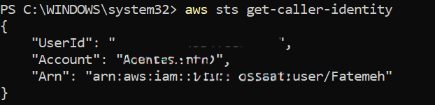

# AWS CDK Pre-Project Checklist

What to check **before** you start an AWS CDK project, plus the mistakes I made and what I learned. Written on Windows/PowerShell.

> Versions change. Always compare against the official CDK docs (link below) instead of trusting a number in this README.

## Why this exists

I was about to rebuild a CDK project from zero. A simple version check showed that my Node.js version wasn't on the CDK's supported list, and fixing it taught me more than I expected.

## The checklist

- [ ] **Node.js** is an LTS version on the CDK's supported table
- [ ] **npm** works (it comes with Node.js)
- [ ] **AWS CLI** is installed
- [ ] **AWS credentials** work: `aws sts get-caller-identity` returns your account
- [ ] **CDK** is installed: `cdk --version`
- [ ] You're in **your own project folder**, not a system folder like `C:\WINDOWS\system32`

## Step 1: check the three tools

```powershell
node --version
npm --version
aws --version
```

| Tool | What it does |
|---|---|
| Node.js | Runs the CDK command-line tool and construct library |
| npm | Installs the CDK and your project's packages |
| AWS CLI | Connects your computer to your AWS account |



## Step 2: check that your Node.js version is supported

The CDK supports Node.js **LTS** (Long Term Support) versions. To find the current table, search for **"Supported Node.js versions for the AWS CDK"** and open the result on `docs.aws.amazon.com`:

https://docs.aws.amazon.com/cdk/v2/guide/node-versions.html

Compare the first number of your `node --version` with the table. If your number isn't listed, it isn't officially supported. That doesn't mean it will break, only that AWS hasn't promised it works.

`[SCREENSHOT: the supported Node.js versions table]`

## Step 3: check that the AWS CLI is connected to your account

```powershell
aws sts get-caller-identity
```

This asks AWS "who am I logged in as?" and changes nothing. If it returns an account and user, CDK can deploy. If it says it can't locate credentials, configure them first.

`[SCREENSHOT: get-caller-identity output, with account number and user ID hidden]`

## Step 4: install the CDK

```powershell
npm install -g aws-cdk
cdk --version
```

`-g` (global) makes the `cdk` command work from any folder. You can also install it per project and run it with `npx cdk`, so everyone on a team uses the same version. Global is convenient, and per project is more consistent.

## Step 5: create a project folder

```powershell
cd $HOME\Documents
mkdir cdk-from-zero
cd cdk-from-zero
```

## Mistakes I made

1. **I never checked whether my Node.js version was supported.** I had v26, which wasn't on the CDK's table. It worked, so I assumed it was fine.
2. **I tried to install the supported version over the newer one.** The Node 24 installer stopped with "A later version of Node.js is already installed." The fix was to uninstall v26 first, then install Node 24 LTS.

`[SCREENSHOT: "A later version of Node.js is already installed" message]`

## How to notice updates yourself

- **Read the notices.** npm prints a message when a newer version exists and gives you the update command.
- **Run `winget upgrade`** on Windows to list installed apps with available updates. Node.js may not appear if it wasn't installed through winget.
- **Once a month**, compare `node --version` with the CDK's supported table.

`[SCREENSHOT: winget upgrade output]`

## What I learned

- Working is not the same as supported.
- A five-minute check before a project saves a confusing error in the middle of it.
- Having the AWS CLI installed doesn't mean it's connected to your account.

## My setup when I wrote this (2026-09-30)

- Node.js 24.x LTS
- npm 11.20.0
- AWS CLI v2
- AWS CDK 2.1143.0

## Related posts

[Medium blog](https://medium.com/@fatemehfeizipur/before-you-start-your-first-aws-cdk-project-the-setup-checklist-i-wish-i-had-8a64225f4028?sharedUserId=fatemehfeizipur)
[LinkedIn post]()
